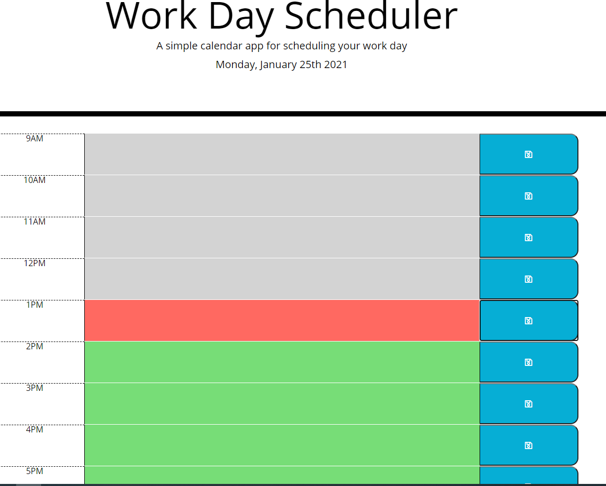
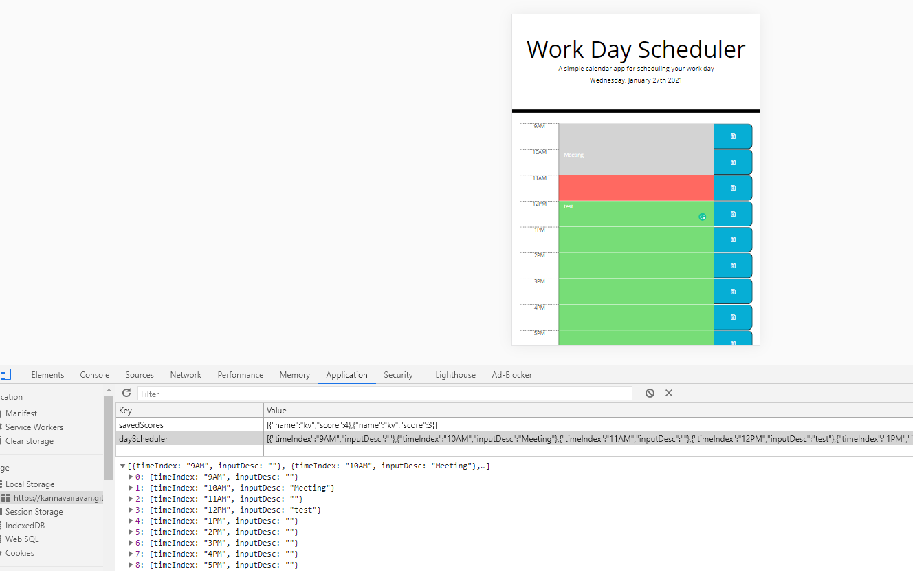

# Project Name: Work Day Scheduler

## Summary

This app will run in the browser and feature dynamically updated HTML and CSS powered by jQuery. This app is using [Moment.js](https://momentjs.com/) library This app is also using local storage to save and retrive JSON objects.

## Description

When I open the work day scheduler then the current
day is displayed at the top of the calendar

---

### Time Block Element

This work day scheduler app display work hours from 8AM to 5PM
Each time block is color-coded to indicate whether it is in the
past (gray), present (red), or future (green)

### Local Storage

Each time block has text area where the uses can enter event and click save button.
The event text is saved in local storage.
When I refresh the page the app will render saved events.

## Link

https://kannavairavan.github.io/Work-Day-Scheduler/

## Repository

https://github.com/KannaVairavan/Work-Day-Scheduler.git

## Technologies

Visual Studio code, HTML5, bootstrap, CSS, Javascript and jQuery
